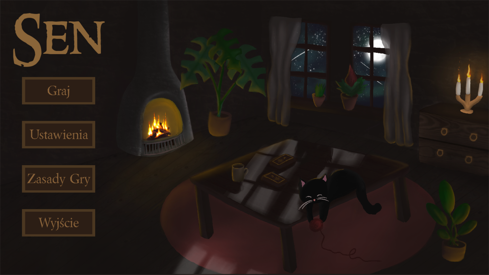
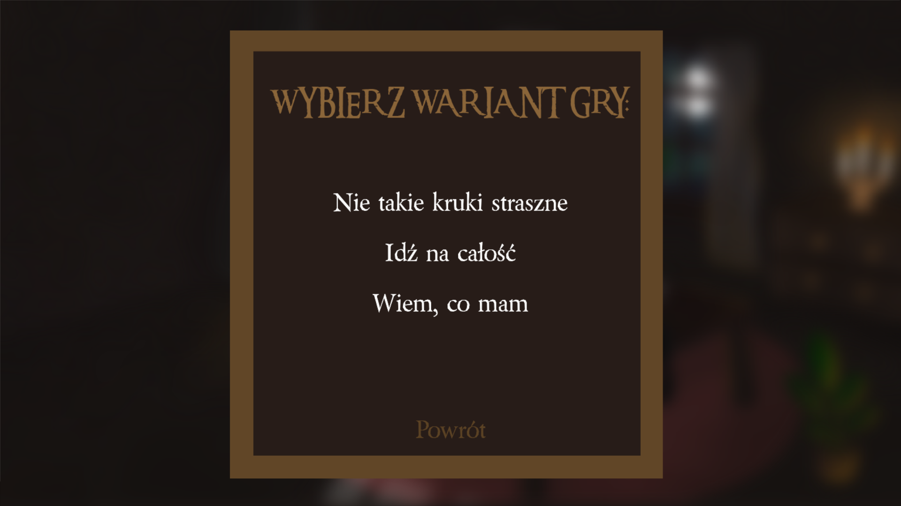
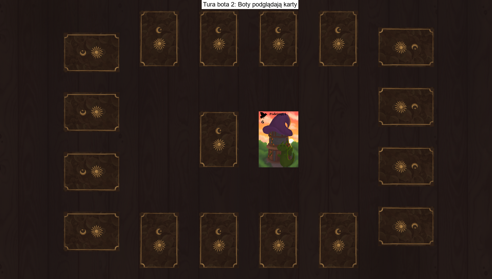

# Gra-karciana-sen
"Sen" to cyfrowa adaptacja gry karcianej, w której gracz rywalizuje z botami, aby uzyskać jak najmniejszą liczbę punktów w swojej ręce. Gra została napisana w Pythonie, korzystając z biblioteki Pygame, zapewniającej prosty i przyjazny graficzny interfejs użytkownika.

## Funkcjonalności

- **Gra dla każdego** – zasady są super proste!
- **Wiele wariantów** - aż 3 warianty gry do wyboru
- **Dynamiczny interfejs graficzny** – intuicyjne sterowanie i czytelne elementy gry.
- **Automatyczne liczenie punktów** – system automatycznie oblicza wynik każdej rundy.
- **Symulacja talii kart** – w grze dostępne są losowe karty zgodne z zasadami oryginalnej gry.

## Wymagania

Aby uruchomić grę, potrzebujesz:
- Python 3.8 lub nowszy
- Biblioteka Pygame 2.1.0 lub nowsza

## Instalacja na Windows (zalecana)

1. Wejdź na stronę: https://malpkakaka.itch.io/sen-kart  
2. Pobierz grę i rozpakuj pliki na swoim komputerze
3. Wejdź w folder Sen_gra_karciana/dist i kliknij Sen.exe 

## Instalacja na Linux

1. Sklonuj repozytorium gry:
   ```bash
   git clone https://github.com/wojtekc135/gra-karciana-sen.git
2. Przejdź do katalogu projektu:
    ```bash
   cd gra-karciana-sen
3. Zanistaluj wymagane zależności:
    ```bash
   pip install -r requirements.txt
4. Przejdź do katalogu z menu.py:
   ```bash
   cd src
5. Uruchom grę:
    ```bash
   python menu.py

## Jak grać?
Uruchom grę poleceniem python menu.py lub klikając plik Sen.exe. Wybierz wariant i rozpocznij rozgrywkę. Każdy gracz (zarówno użytkownik jak i bot) ma możliwość wymiany kart, dążąc do uzyskania jak najmniejszej liczby punktów. Gra kończy się, gdy któryś z graczy ogłosi "Pobudka!", a pozostałe karty zostaną rozliczone. Wygrywa gracz z najmniejszą liczbą punktów.

  
  



## Zasoby
Ten program został stworzony w oparciu o zasady i mechanikę gry "Sen" wydawnicta Nasza Księgarnia.  
Muzyka została pobrana ze strony Pixabay: https://pixabay.com/pl/music/
## Licencja
Ten projekt jest udostępniany na licencji MIT. Szczegóły znajdziesz w pliku LICENSE.

## Autorzy
- **Wojciech Cieślik** - Gameplay
- **Magdalena Majda** - Warianty, logika gry
- **Wiktoria Szczepaniak** - Warianty, logika gry
- **Joanna Frączyk** - Warianty, logika gry
- **Olga Chruściel** - Boty
- **Maja Skóra** - Menu
- **Hanna Szlęk** - Grafika
